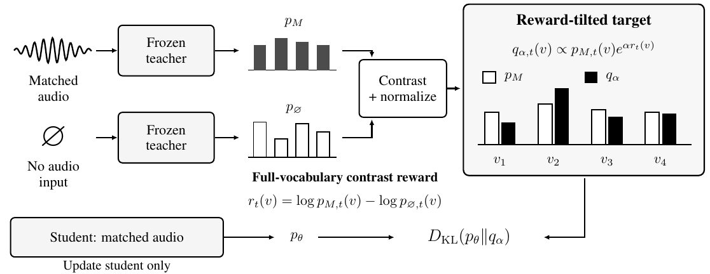

# RT-OPD: Reward-Tilted On-Policy Distillation

**RT-OPD** is an on-policy distillation method for compact audio-language models.
At student-generated prefixes, a frozen teacher predicts next-token probabilities
with and without audio. Their log-probability contrast reshapes the teacher target,
and the student learns from it through reverse KL alongside answer supervision.

This repository provides training with **Ke-Omni-R-3B** and **Qwen2.5-Omni-3B**
students, data preparation, evaluation, and inference. The Ke-based model trained
with RT-OPD is released as **Mizar-3B**.

**[Released model](https://huggingface.co/KaiyangLi/Mizar-3B)** · **[Training manifests](https://huggingface.co/KaiyangLi/Mizar-3B/tree/3b2e2b2145874dd496a506f34187767ef91c50f0/reproducibility)** · **[Training audio](https://huggingface.co/datasets/bmmv-9x2q7/aa-opd-v1-training-audio-cb33687)** · **[Data guide](docs/DATA.md)** · **[Evaluation](docs/EVALUATION.md)**

## Method



**Figure 1.** RT-OPD contrasts the same teacher's predictions with and without
audio, then trains the student against the reshaped target.

## Models and data

### Models

| Role | Download / model card | Used for |
|---|---|---|
| **Mizar-3B adapter** | [KaiyangLi/Mizar-3B](https://huggingface.co/KaiyangLi/Mizar-3B) | Best Ke seed by Macro-3: seed 85, step 626; LoRA adapter, requires the Ke 3B base |
| Ke student base | [KE-Team/Ke-Omni-R-3B](https://huggingface.co/KE-Team/Ke-Omni-R-3B) | Ke training initialization and released-adapter inference |
| Qwen student base | [Qwen/Qwen2.5-Omni-3B](https://huggingface.co/Qwen/Qwen2.5-Omni-3B) | Qwen training initialization |
| Frozen teacher | [KE-Team/Ke-Omni-R](https://huggingface.co/KE-Team/Ke-Omni-R) | Shared 7B teacher for both students; training only |

Mizar-3B is released as a **LoRA adapter requiring the Ke 3B base**.
Qwen training code is included; a trained Qwen checkpoint is not included.

### Training and evaluation data

| Asset | Source / download | Role in this release |
|---|---|---|
| **Exact experiment manifests** | [Frozen manifest archive](https://huggingface.co/KaiyangLi/Mizar-3B/blob/3b2e2b2145874dd496a506f34187767ef91c50f0/reproducibility/frozen_data.tar.gz) | About 4.5 MB: exact 10,000 training rows, teacher gate, vocabulary mask, benchmark manifests and audio hashes; no raw audio |
| Training audio snapshot | [Frozen AudioMCQ archive](https://huggingface.co/datasets/bmmv-9x2q7/aa-opd-v1-training-audio-cb33687) | 8.17 GB archive; the experiment manifests select the exact 10,000 rows |
| Training source | [AudioMCQ-StrongAC-GeminiCoT](https://huggingface.co/datasets/AudioLLMs/dcase2026_task5_AudioMCQ-StrongAC-GeminiCoT) | Original upstream dataset |
| MMAU full | [MMAU-test](https://huggingface.co/datasets/gamma-lab-umd/MMAU-test) | 9,000 test examples; hidden labels, official scoring |
| MMAR | [BoJack/MMAR](https://huggingface.co/datasets/BoJack/MMAR) | 1,000 evaluation examples |
| ADQA-cl | [DCASE2026-Task5-DevSet](https://huggingface.co/datasets/Harland/DCASE2026-Task5-DevSet) | Frozen 1,577-example evaluation manifest |
| MMAU mini | [MMAU-test-mini](https://huggingface.co/datasets/gamma-lab-umd/MMAU-test-mini) | Separate 1,000-example set; excluded from reported Macro-3 |

The preparation scripts download the pinned models and audio separately from
the manifests and verify their hashes. [Data versions and preparation](docs/DATA.md).

## Setup

```bash
git clone https://github.com/KaiyangLi1992/RT-OPD.git
cd RT-OPD
bash ke/environment/setup.sh
ke/.venv/bin/hf auth login
```

The code and Mizar-3B model/manifests require authorized GitHub and HF access.
The setup creates an isolated Python **3.10** environment with **PyTorch
2.5.1+cu124**, **Transformers 4.52.4**, and **PEFT 0.19.1**. Complete pinned
packages: [Ke environment](ke/environment/requirements.lock) and
[Qwen environment](qwen/environment/requirements.lock).

**Training hardware:** Linux x86-64, one node with **four matching NVIDIA GPUs**,
each exposing **at least 44 GiB VRAM** and native BF16 support, plus a
CUDA-12.4-compatible driver.
Allow at least **150 GB of disk per profile** for the complete workflow.
Single-audio inference does not require four GPUs.

## Inference

```bash
ke/.venv/bin/python tools/infer.py \
  --adapter KaiyangLi/Mizar-3B \
  --revision 3b2e2b2145874dd496a506f34187767ef91c50f0 \
  --audio /absolute/path/example.wav \
  --question "Which sound is audible?" \
  --choices "A dog barking" "A piano playing"
```

The helper downloads the Ke base and vocabulary mask, then loads the adapter.
For older GPUs, add `--dtype float16`. Benchmark results use the vLLM evaluation
pipeline described below.

For a locally trained Qwen adapter, use `--student qwen --adapter
/absolute/path/to/checkpoint-626`; the helper selects the corresponding Qwen base.

## Training

Both students train from their original base with fresh LoRA for **two epochs /
626 optimizer updates**, on the same **10,000 examples**, at global batch **32**.
The Ke learning rate is **7.5e-5**; Qwen uses **2.5e-5**.

### Ke student

```bash
ke/.venv/bin/python ke/scripts/prepare.py --scope training
./launch_ke.sh plan --seed 85
./launch_ke.sh smoke --seed 85 --gpus 0,1,2,3
./launch_ke.sh train --seed 85 --gpus 0,1,2,3
```

### Qwen student

```bash
bash qwen/environment/setup.sh
qwen/.venv/bin/hf auth login
qwen/.venv/bin/python qwen/scripts/prepare.py --scope training
./launch_qwen.sh plan --seed 92
./launch_qwen.sh smoke --seed 92 --gpus 0,1,2,3
./launch_qwen.sh train --seed 92 --gpus 0,1,2,3
```

`plan` prints settings without allocating GPUs. `smoke` performs **two real
optimizer updates** and verifies its checkpoint. `train` runs or verifies this
qualification before starting fresh formal training. The smoke always uses the
profile's first seed and produces an engineering checkpoint, not a main result.
Use idle GPUs within your allocation; `--gpus auto` accepts four GPUs already
exposed by the scheduler.

<details>
<summary><strong>All five seeds, output paths, and interrupted runs</strong></summary>

Run sequentially on the same four-GPU allocation:

```bash
for seed in 82 83 84 85 86; do ./launch_ke.sh train --seed "$seed" --gpus 0,1,2,3; done
for seed in 92 93 94 95 96; do ./launch_qwen.sh train --seed "$seed" --gpus 0,1,2,3; done
```

Final adapters are saved under:

```text
ke/runs/training/rtopd-ke-s85/attempt1/checkpoint-626
qwen/runs/training/rtopd-qwen-s92/attempt1/checkpoint-626
```

Interrupted attempts are preserved. After diagnosing a failure, use
`--attempt attempt2` for a fresh run. Formal training does not silently resume
from an intermediate checkpoint. `RTOPD_PYTHON=/absolute/path/python` overrides
the launcher's environment path.

</details>

## Results and evaluation

Accuracy in percent. **Macro-3** is the unweighted mean of MMAU full, MMAR and
ADQA-cl accuracies. **±** is the sample standard deviation of per-seed Macro-3.

| Student / result | MMAU full · 9,000 | MMAR · 1,000 | ADQA-cl · 1,577 | Macro-3 |
|---|---:|---:|---:|---:|
| Ke · mean of seeds 82–86 | 72.72 | 60.08 | 56.45 | **63.08 ± 0.36** |
| Qwen · mean of seeds 92–96 | 72.18 | 58.90 | 55.70 | **62.26 ± 0.15** |
| Mizar-3B · Ke seed 85 | 72.78 | 61.10 | 57.07 | **63.65** |

The released adapter was selected **post hoc by highest Macro-3** among the five
Ke seeds; it is reported separately from the five-seed mean. All final
checkpoints are fixed at step 626. [Per-seed results](results/main_results.json).

[Evaluation commands](docs/EVALUATION.md) cover benchmark preparation,
generation and scoring. MMAU full uses hidden labels and official scoring;
MMAU mini is excluded from Macro-3. Recompute the recorded table with:

```bash
python3 tools/summarize.py
```

The table reports the original experiments. Release checks include CPU tests,
file-hash verification and single-audio GPU inference; four-GPU BF16 training
and a full 626-step run have not been rerun for this package.

## Asset terms

Pretrained models and datasets retain the terms stated in their linked source cards.
