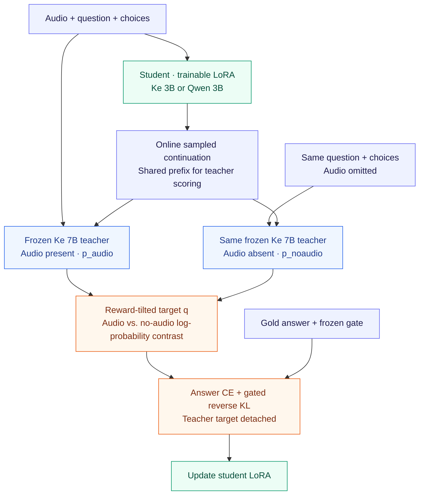

# RT-OPD: Reward-Tilted On-Policy Distillation

RT-OPD trains audio-language students to answer questions about sounds. At each
student-generated prefix, a frozen teacher scores the continuation **with audio
and without audio**. Their probability difference tilts the distillation target
toward tokens supported by the audio.

This repository contains the main absent-audio RT-OPD experiment for
**Ke-Omni-R-3B** and **Qwen2.5-Omni-3B**, with a shared **Ke-Omni-R 7B teacher**:
training code, pinned environments, exact data manifests, evaluation tools, and
a released Ke LoRA checkpoint.

**[Model](https://huggingface.co/KaiyangLi/RT-OPD-Ke-3B)** · **[Training manifests](https://huggingface.co/KaiyangLi/RT-OPD-Ke-3B/tree/3b2e2b2145874dd496a506f34187767ef91c50f0/reproducibility)** · **[Training audio](https://huggingface.co/datasets/bmmv-9x2q7/aa-opd-v1-training-audio-cb33687)** · **[Data guide](docs/DATA.md)** · **[Method & recipe](docs/REVIEWER_GUIDE.md)** · **[Evaluation](docs/EVALUATION.md)**

> **Access:** This GitHub repository and the released HF model/manifests are
> private. Reviewers need access to both. The source model and dataset links
> below identify the separate upstream assets.

## Method



**Figure 1.** Both teacher passes score the same student-generated continuation.
Only the student LoRA is updated; the teacher stays frozen.

```text
log q = log_softmax(log p_audio + α · (log p_audio − log p_noaudio))
loss  = answer CE + 0.25 · frozen_gate · KL(p_student || q),    α = 1
```

All distributions use the same frozen valid-vocabulary mask. The frozen gate
activates distillation for teacher-correct, parseable training examples;
every example retains gold-answer cross-entropy (CE). See the
[reviewer guide](docs/REVIEWER_GUIDE.md) for the equation-to-code map and full recipe.

## Models and data

### Models

| Role | Download / model card | Used for |
|---|---|---|
| **Released RT-OPD Ke adapter** | [KaiyangLi/RT-OPD-Ke-3B](https://huggingface.co/KaiyangLi/RT-OPD-Ke-3B) | Best Ke seed by Macro-3: seed 85, step 626; LoRA adapter, requires the Ke 3B base |
| Ke student base | [KE-Team/Ke-Omni-R-3B](https://huggingface.co/KE-Team/Ke-Omni-R-3B) | Ke training initialization and released-adapter inference |
| Qwen student base | [Qwen/Qwen2.5-Omni-3B](https://huggingface.co/Qwen/Qwen2.5-Omni-3B) | Qwen training initialization |
| Frozen teacher | [KE-Team/Ke-Omni-R](https://huggingface.co/KE-Team/Ke-Omni-R) | Shared 7B teacher for both students; training only |

The HF release contains **adapter weights**, not a merged standalone model or
optimizer state. Qwen training is provided; no trained Qwen checkpoint is
published in this release. Base-model revisions and file hashes are pinned in
[Ke model configuration](ke/configs/models_ke_grid16.json) and
[Qwen model configuration](qwen/configs/models_ke_grid16.json).

### Training and evaluation data

| Asset | Source / download | Role in this release |
|---|---|---|
| **Exact experiment manifests** | [Frozen manifest archive](https://huggingface.co/KaiyangLi/RT-OPD-Ke-3B/blob/3b2e2b2145874dd496a506f34187767ef91c50f0/reproducibility/frozen_data.tar.gz) | About 4.5 MB: exact 10,000 training rows, teacher gate, vocabulary mask, benchmark manifests and audio hashes; no raw audio |
| Training audio snapshot | [Frozen AudioMCQ archive](https://huggingface.co/datasets/bmmv-9x2q7/aa-opd-v1-training-audio-cb33687) | 8.17 GB archive; the experiment manifests select the exact 10,000 rows |
| Training source | [AudioMCQ-StrongAC-GeminiCoT](https://huggingface.co/datasets/AudioLLMs/dcase2026_task5_AudioMCQ-StrongAC-GeminiCoT) | Original upstream dataset |
| MMAU full | [MMAU-test](https://huggingface.co/datasets/gamma-lab-umd/MMAU-test) | 9,000 test examples; hidden labels, official scoring |
| MMAR | [BoJack/MMAR](https://huggingface.co/datasets/BoJack/MMAR) | 1,000 evaluation examples |
| ADQA-cl | [DCASE2026-Task5-DevSet](https://huggingface.co/datasets/Harland/DCASE2026-Task5-DevSet) | Frozen 1,577-example evaluation manifest |
| MMAU mini | [MMAU-test-mini](https://huggingface.co/datasets/gamma-lab-umd/MMAU-test-mini) | Separate 1,000-example set; excluded from reported Macro-3 |

Preparation downloads immutable revisions, reconstructs local audio/manifests,
and checks SHA-256. **Manifest download alone does not include audio or model
weights.** See the [data guide](docs/DATA.md) for every pinned revision, download
scope, and upstream provenance.

## Setup

```bash
git clone https://github.com/KaiyangLi1992/RT-OPD.git
cd RT-OPD
bash ke/environment/setup.sh
ke/.venv/bin/hf auth login
```

Use an authenticated Git client and an HF account with access to the release.
The setup creates an isolated Python **3.10** environment with **PyTorch
2.5.1+cu124**, **Transformers 4.52.4**, and **PEFT 0.19.1**. Complete pinned
packages: [Ke environment](ke/environment/requirements.lock) and
[Qwen environment](qwen/environment/requirements.lock).

**Training hardware:** Linux x86-64, one node with **four matching NVIDIA GPUs**,
each exposing **at least 44 GiB VRAM** and native BF16 support, plus a
CUDA-12.4-compatible driver. The original runs used four RTX 6000 Ada GPUs.
Allow at least **150 GB of disk per profile** for the complete workflow.
Single-audio inference has a separate memory footprint and does not require the
four-GPU training setup.

## Try the released Ke model

After the Ke setup and HF login above, supply your own audio file:

```bash
ke/.venv/bin/python tools/infer.py \
  --adapter KaiyangLi/RT-OPD-Ke-3B \
  --revision 3b2e2b2145874dd496a506f34187767ef91c50f0 \
  --audio /absolute/path/example.wav \
  --question "Which sound is audible?" \
  --choices "A dog barking" "A piano playing"
```

The helper downloads the pinned Ke base, attaches the adapter to its Thinker,
and uses the vocabulary mask from the small manifest archive. No teacher or
training audio is needed. For older GPUs, add `--dtype float16`.
This convenience example is separate from the paper's frozen vLLM evaluator.

For a locally trained Qwen adapter, use `--student qwen --adapter
/absolute/path/to/checkpoint-626`; the helper selects the corresponding Qwen base.

## Training

Both students train from their original base with fresh LoRA for **two epochs /
626 optimizer updates**, on the same **10,000 examples**, at global batch **32**.
The Ke learning rate is **7.5e-5**; Qwen uses **2.5e-5**. Full settings are in the
[training recipe](docs/REVIEWER_GUIDE.md#effective-recipe).

### Ke student

After the Ke setup:

```bash
ke/.venv/bin/python ke/scripts/prepare.py --scope training
./launch_ke.sh plan --seed 85
./launch_ke.sh smoke --seed 85 --gpus 0,1,2,3
./launch_ke.sh train --seed 85 --gpus 0,1,2,3
```

### Qwen student

```bash
bash qwen/environment/setup.sh
qwen/.venv/bin/hf auth login
qwen/.venv/bin/python qwen/scripts/prepare.py --scope training
./launch_qwen.sh plan --seed 92
./launch_qwen.sh smoke --seed 92 --gpus 0,1,2,3
./launch_qwen.sh train --seed 92 --gpus 0,1,2,3
```

`plan` prints settings without allocating GPUs. `smoke` performs **two real
optimizer updates** and verifies its checkpoint. `train` runs or verifies this
qualification before starting fresh formal training. The smoke always uses the
profile's first seed and produces an engineering checkpoint, not a main result.
Use idle GPUs within your allocation; `--gpus auto` accepts four GPUs already
exposed by the scheduler.

<details>
<summary><strong>All five seeds, output paths, and interrupted runs</strong></summary>

Run sequentially on the same four-GPU allocation:

```bash
for seed in 82 83 84 85 86; do ./launch_ke.sh train --seed "$seed" --gpus 0,1,2,3; done
for seed in 92 93 94 95 96; do ./launch_qwen.sh train --seed "$seed" --gpus 0,1,2,3; done
```

Final adapters are saved under:

```text
ke/runs/training/rtopd-ke-s85/attempt1/checkpoint-626
qwen/runs/training/rtopd-qwen-s92/attempt1/checkpoint-626
```

Interrupted attempts are preserved. After diagnosing a failure, use
`--attempt attempt2` for a fresh run. Formal training does not silently resume
from an intermediate checkpoint. `RTOPD_PYTHON=/absolute/path/python` overrides
the launcher's environment path.

</details>

## Results and evaluation

Accuracy in percent. **Macro-3** is the unweighted mean of MMAU full, MMAR and
ADQA-cl accuracies. **±** is the sample standard deviation of per-seed Macro-3.

| Student / result | MMAU full · 9,000 | MMAR · 1,000 | ADQA-cl · 1,577 | Macro-3 |
|---|---:|---:|---:|---:|
| Ke · mean of seeds 82–86 | 72.72 | 60.08 | 56.45 | **63.08 ± 0.36** |
| Qwen · mean of seeds 92–96 | 72.18 | 58.90 | 55.70 | **62.26 ± 0.15** |
| Released Ke · seed 85 | 72.78 | 61.10 | 57.07 | **63.65** |

The released adapter was selected **post hoc by highest Macro-3** among the five
Ke seeds; it is reported separately from the five-seed mean. All final
checkpoints are fixed at step 626. Seed 86 has the best MMAU-only score (73.12%).
Exact counts and provenance are in [main_results.json](results/main_results.json).

Follow the [evaluation guide](docs/EVALUATION.md) to prepare benchmarks, run the
frozen generation/scoring pipeline, and export MMAU full predictions for official
scoring. Hidden MMAU labels are not bundled; MMAU mini does not replace full9k.
To recompute the recorded aggregate table without a GPU:

```bash
python3 tools/summarize.py
```

## Reproducibility status

**Completed:** original source/checkpoint hash verification; 40 CPU tests;
all 20 epoch-order reconstructions; clean-package manifest download;
12,577 evaluation-audio hash checks; and HF adapter re-download plus actual
single-audio GPU inference.

**Still unverified for this release:** a new four-GPU BF16 qualification and full
626-step retraining. Nitro2's 24GB TITAN RTX cards do not meet the training
requirements; Mantis advertises at most three GPUs per node; the original
training host was unreachable. Historical results above come from the original
run records. See [validation evidence and limits](docs/VALIDATION.md) before
interpreting a new run as a reproduction.

## Repository guide

| Path | Contents |
|---|---|
| [`ke/`](ke/) / [`qwen/`](qwen/) | Separate student configurations, pinned environments, training and evaluation code |
| [`launch_ke.sh`](launch_ke.sh) / [`launch_qwen.sh`](launch_qwen.sh) | Plan, smoke-test and training entry points |
| [`tools/infer.py`](tools/infer.py) | Single-audio inference with a released or locally trained adapter |
| [`docs/REVIEWER_GUIDE.md`](docs/REVIEWER_GUIDE.md) | Method, effective hyperparameters and code map |
| [`docs/DATA.md`](docs/DATA.md) | Exact model/data revisions and preparation instructions |
| [`docs/EVALUATION.md`](docs/EVALUATION.md) | Benchmark reproduction and official scoring |
| [`docs/VALIDATION.md`](docs/VALIDATION.md) | Checks performed and remaining limitations |
| [`results/main_results.json`](results/main_results.json) | Original per-seed results and provenance |

The release preserves the original loss and training algorithm, with portability
fixes for student selection, preparation, epoch orders and launch paths. It
covers the main absent-audio method; other inherited research utilities are
explained in the reviewer guide.

## Asset terms

Pretrained models and datasets retain their upstream terms; consult the model
and dataset cards linked above. This repository does not grant a new blanket
license for third-party weights or audio.
